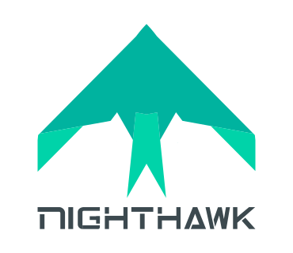

  <a href="https://khulnasoft.com/meshplay">
    <picture align="center">
      <source media="(prefers-color-scheme: dark)" srcset="https://raw.githubusercontent.com/meshplay/meshplay/master/.github/assets/images/meshplay/meshplay-logo-dark-text-side.png"  width="70%" align="center" style="margin-bottom:20px;">
      <source media="(prefers-color-scheme: light)" srcset="https://raw.githubusercontent.com/meshplay/meshplay/master/ui/public/static/img/meshplay-logo-light-text-side.png" width="70%" align="center" style="margin-bottom:20px;">
      
    </picture>
  </a>  

 
# Meshplay Adapter for Nighthawk

<h2><a href="https://khulnasoft.com/meshplay">Meshplay</a></h2>

As a self-service engineering platform, <a href="https://meshplay.khulnasoft.com">Meshplay</a> enables collaborative design and operation of cloud native infrastructure. Through it's extension points, Meshplay offers the ability to optionally plugin adapters in order to more deeply integrate with specific systems like <a href="https://getnighthawk.dev">Nighthawk</a>.

<h2><a href="https://khulnasoft.com/meshplay">Nighthawk</a></h2>

  
<i>If you’re using Meshplay or if you like the project, please <a href="https://github.com/meshplay/meshplay/stargazers">★</a> star this repository to show your support! 🤩</i>

<h2> <a href="https://slack.meshplay.khulnasoft.com">Community</a> and <a href="https://docs-meshplay.khulnasoft.com/project/contributing">Contributing</a></h2>
Our projects are community-built and welcome collaboration. 👍 Be sure to see the <a href="https://khulnasoft.com/community/newcomers">Contributor Journey Map</a> for a tour of resources available to you and jump into our <a href="https://slack.meshplay.khulnasoft.com">Slack</a>! Contributors are expected to adhere to the <a href="https://github.com/cncf/foundation/blob/master/code-of-conduct.md">CNCF Code of Conduct</a>.

✔️ <em><strong>Join</strong></em> any or all of the weekly meetings on the <a href="https://meshplay.khulnasoft.com/calendar">community calendar</a>. 
✔️ <em><strong>Watch</strong></em> community <a href="https://www.youtube.com/channel/UCFL1af7_wdnhHXL1InzaMvA?sub_confirmation=1">meeting recordings</a>. 
✔️ <em><strong>To access the Community Drive</strong></em>, fill <a href="https://khulnasoft.com/newcomer">Community Member Form</a>. 
✔️ <em><strong>Discuss</strong></em> in the <a href="https://discuss.khulnasoft.com">Community Forum</a>. 

<i>Not sure where to start?</i> Grab an open issue with the <a href="https://github.com/issues?q=is%3Aopen+is%3Aissue+archived%3Afalse+org%3Ameshplay+org%3Ameshplay+org%3Aservice-mesh-performance+org%3Aservice-mesh-patterns+org%3Akhulnasoft+label%3A%22help+wanted%22+">help-wanted label</a>.

**License**

This repository and site are available as open source under the terms of the [Apache 2.0 License](https://opensource.org/licenses/Apache-2.0).

